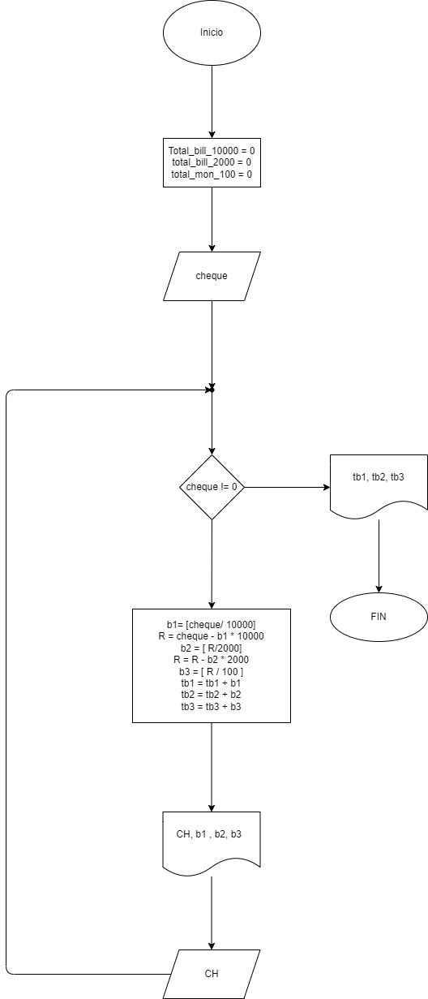

# Ejercicio 3
El cajero de un banco solo dispone de billetes de $10000, $2000 y monedas de $100. su funcion es cambiar los cheques a los clientes, dandoles el menor numero posible de billetes. Asumiendo que todos los cheques son multiplos de $100 , hacer el diagrama de flujo y el programa en Python que reciba el valor del cheque a cambiar y que le informe al cajero cuantos billetes de cada denominacion debe entregar. como no se sabe cuantos clientes vienen al dia, el programa debe terminar cuando reciba cero como valor del cheque, y al final del dia debe informar cuantos billetes de cada denominacion se gastaron. 
